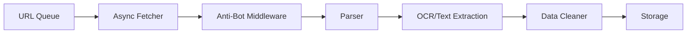

# Playwright-Async-Crawler-Suite

[English](README_EN.md) | 简体中文

一个基于 Playwright 的高性能异步爬虫框架，专为复杂的反爬虫场景设计。

## ✨ 核心特性

### 🚀 高性能异步架构
- 基于 Playwright + Asyncio 的生产者-消费者模型
- 支持高并发数据采集
- 智能并发控制和资源管理

### 🛡️ 反检测框架
- Browser Context 隔离
- 指纹混淆技术
- 动态 Cookie 自动更新
- User-Agent 轮换
- Stealth.js 注入

### 🔧 模块化设计
- 抽象基类设计，易于扩展
- 依赖注入模式
- 可配置的中间件系统
- 测试模式支持

### 📊 多模态 ETL 流水线
- **集成 PaddleOCR** 实现高精度中文文本提取（支持 Tesseract 作为备选）
- 数据清洗和验证
- Excel 格式化输出
- 增量保存和文件合并

## 📦 安装

### 环境要求
- Python 3.8+
- pip

### 安装步骤

```bash
# 克隆仓库
git clone https://github.com/LouisUltra/Playwright-Async-Crawler-Suite.git
cd Playwright-Async-Crawler-Suite

# 创建虚拟环境（推荐）
python -m venv venv
source venv/bin/activate  # Linux/Mac
# 或
venv\\Scripts\\activate  # Windows

# 安装依赖
pip install -r requirements.txt

# 安装 Playwright 浏览器
playwright install chromium
```

## 🎯 快速开始

> **💡 提示**: 默认配置启用了 **Mock 模式** (`test_mode: true`)，可以在不访问真实网站的情况下测试框架功能。这样可以避免网络问题和反爬虫检测，确保流畅的开发体验。

### 基本用法

```python
import asyncio
from core import BrowserManager, AntiDetectionMiddleware
from spiders import InstructionSpider
from config import load_config

async def main():
    # 加载配置
    config = load_config()
    
    # 设置为 False 以访问真实网站（需要配置正确的 URL）
    config['test_mode'] = True  # 默认使用 Mock 模式
    
    # 初始化组件
    browser = await BrowserManager.get_instance(config)
    middleware = AntiDetectionMiddleware(config)
    
    # 创建爬虫
    spider = InstructionSpider(browser, middleware, config)
    
    # 执行爬取
    keywords = ['阿司匹林', '布洛芬']
    stats = await spider.run(keywords, output_dir='output')
    
    print(f"完成！成功: {stats['successful']}, 失败: {stats['failed']}")
    
    # 清理
    await browser.close()

if __name__ == '__main__':
    asyncio.run(main())
```

### 配置文件

编辑 `config/config.yaml` 来自定义爬虫行为：

```yaml
# 测试模式：默认启用以避免访问真实网站
test_mode: true  # 设置为 false 以访问真实网站

browser:
  headless: false
  viewport:
    width: 1920
    height: 1080
  user_agents_file: "config/user_agents.txt"
  stealth_script: "config/stealth.min.js"

anti_detection:
  max_concurrent: 3
  request_delay:
    min: 1.0
    max: 3.0
  retry:
    max_attempts: 3
    backoff_factor: 2.0
```

## 📚 架构设计



### 核心组件

1. **BrowserManager** - 浏览器上下文管理
   - 单例模式
   - User-Agent 轮换
   - Stealth 脚本注入
   - 资源阻断

2. **AntiDetectionMiddleware** - 反检测中间件
   - 重试机制
   - 随机延迟
   - 并发控制
   - CAPTCHA 检测

3. **BaseSpider** - 爬虫基类
   - 抽象接口定义
   - 通用执行流程
   - 测试模式支持

4. **InstructionSpider** - 说明书爬虫
   - PDF 下载
   - OCR 集成
   - 分页支持

5. **IngredientSpider** - 成分数据爬虫
   - 表格数据提取
   - 字段映射
   - 增量保存

## 🧪 测试

```bash
# 运行所有测试
pytest tests/ -v

# 运行特定测试
pytest tests/test_browser_manager.py -v

# 查看覆盖率
pytest tests/ --cov=. --cov-report=html
```

## 📖 文档

- [架构设计](docs/architecture.md)
- [API 参考](docs/api_reference.md)
- [配置指南](docs/configuration.md)
- [开发指南](docs/development.md)

## ⚠️ 免责声明 (Legal Disclaimer)

**本项目仅供教育和研究目的使用。** 数据采集逻辑旨在演示异步架构和反爬虫技术的实现方法。

### 重要声明

1. **遵守 robots.txt**: 请尊重目标网站的 `robots.txt` 文件和服务条款
2. **禁止高频攻击**: 不得使用本工具进行高频率请求或对服务器造成压力
3. **禁止商业转售**: 不得将本工具用于商业数据转售或其他商业用途
4. **法律责任**: 作者不对因滥用本代码而产生的任何法律后果承担责任
5. **默认 Mock 模式**: 默认配置使用 **Mock 模式**，避免对政府服务器发起实际网络请求

### 合规使用建议

- ✅ 用于学习 Python 异步编程和 Playwright 框架
- ✅ 用于研究反爬虫技术和对策
- ✅ 用于个人技能提升和项目展示
- ❌ 不要用于大规模数据采集
- ❌ 不要用于商业目的
- ❌ 不要违反目标网站的使用条款

**使用本工具即表示您同意遵守上述条款，并自行承担所有使用风险。**

---

## 📄 许可证

MIT License

## 🤝 贡献

欢迎提交 Issue 和 Pull Request！

## 📧 联系方式

如有问题或建议，请通过 Issue 联系。
