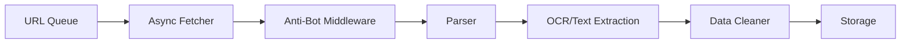

# Playwright-Async-Crawler-Suite

English | [简体中文](README.md)

A high-performance async web scraping framework based on Playwright, designed for complex anti-bot scenarios.

## ✨ Key Features

### 🚀 High-Performance Async Architecture
- Producer-consumer model based on Playwright + Asyncio
- High-concurrency data collection support
- Intelligent concurrency control and resource management

### 🛡️ Anti-Detection Framework
- Browser Context isolation
- Fingerprint obfuscation
- Dynamic cookie auto-update
- User-Agent rotation
- Stealth.js injection

### 🔧 Modular Design
- Abstract base class design for easy extension
- Dependency injection pattern
- Configurable middleware system
- Test mode support

### 📊 Multi-modal ETL Pipeline
- **Integrated PaddleOCR** for high-precision Chinese text extraction (with Tesseract as fallback)
- Data cleaning and validation
- Formatted Excel output
- Incremental saving and file merging

## 📦 Installation

### Requirements
- Python 3.8+
- pip

### Installation Steps

```bash
# Clone repository
git clone https://github.com/LouisUltra/Playwright-Async-Crawler-Suite.git
cd Playwright-Async-Crawler-Suite

# Create virtual environment (recommended)
python -m venv venv
source venv/bin/activate  # Linux/Mac
# or
venv\\Scripts\\activate  # Windows

# Install dependencies
pip install -r requirements.txt

# Install Playwright browsers
playwright install chromium
```

## 🎯 Quick Start

> **💡 Tip**: The default configuration enables **Mock Mode** (`test_mode: true`), allowing you to test the framework without accessing real websites. This avoids network issues and anti-bot detection, ensuring a smooth development experience.

### Basic Usage

```python
import asyncio
from core import BrowserManager, AntiDetectionMiddleware
from spiders import InstructionSpider
from config import load_config

async def main():
    # Load configuration
    config = load_config()
    
    # Set to False to access real websites (requires proper URL configuration)
    config['test_mode'] = True  # Default: use Mock mode
    
    # Initialize components
    browser = await BrowserManager.get_instance(config)
    middleware = AntiDetectionMiddleware(config)
    
    # Create spider
    spider = InstructionSpider(browser, middleware, config)
    
    # Run scraping
    keywords = ['aspirin', 'ibuprofen']
    stats = await spider.run(keywords, output_dir='output')
    
    print(f"Done! Success: {stats['successful']}, Failed: {stats['failed']}")
    
    # Cleanup
    await browser.close()

if __name__ == '__main__':
    asyncio.run(main())
```

### Configuration

Edit `config/config.yaml` to customize spider behavior:

```yaml
# Test mode: enabled by default to avoid accessing real websites
test_mode: true  # Set to false to access real websites

browser:
  headless: false
  viewport:
    width: 1920
    height: 1080
  user_agents_file: "config/user_agents.txt"
  stealth_script: "config/stealth.min.js"

anti_detection:
  max_concurrent: 3
  request_delay:
    min: 1.0
    max: 3.0
  retry:
    max_attempts: 3
    backoff_factor: 2.0
```

## 📚 Architecture



### Core Components

1. **BrowserManager** - Browser context management
   - Singleton pattern
   - User-Agent rotation
   - Stealth script injection
   - Resource blocking

2. **AntiDetectionMiddleware** - Anti-detection middleware
   - Retry mechanism
   - Random delays
   - Concurrency control
   - CAPTCHA detection

3. **BaseSpider** - Spider base class
   - Abstract interface definition
   - Common execution flow
   - Test mode support

4. **InstructionSpider** - Instruction manual spider
   - PDF download
   - OCR integration
   - Pagination support

5. **IngredientSpider** - Ingredient data spider
   - Table data extraction
   - Field mapping
   - Incremental saving

## 🧪 Testing

```bash
# Run all tests
pytest tests/ -v

# Run specific tests
pytest tests/test_browser_manager.py -v

# View coverage
pytest tests/ --cov=. --cov-report=html
```

## 📖 Documentation

- [Architecture Design](docs/architecture.md)
- [API Reference](docs/api_reference.md)
- [Configuration Guide](docs/configuration.md)
- [Development Guide](docs/development.md)

## ⚠️ Disclaimer

**This project is for educational and research purposes only.** The data mining logic is designed to demonstrate asynchronous architecture and anti-scraping techniques.

### Important Notice

1. **Respect robots.txt**: Please respect the target website's `robots.txt` file and terms of service
2. **No High-Frequency Attacks**: Do not use this tool for high-frequency requests or server overload
3. **No Commercial Reselling**: Do not use this tool for commercial data reselling or other commercial purposes
4. **Legal Responsibility**: The author bears no responsibility for any legal consequences arising from the misuse of this code
5. **Default Mock Mode**: Default configuration uses **Mock Mode** to prevent actual network requests to government servers

### Compliance Guidelines

- ✅ Use for learning Python async programming and Playwright framework
- ✅ Use for researching anti-scraping techniques and countermeasures
- ✅ Use for personal skill development and project showcase
- ❌ Do not use for large-scale data collection
- ❌ Do not use for commercial purposes
- ❌ Do not violate target website's terms of service

**By using this tool, you agree to comply with the above terms and assume all risks associated with its use.**

---

## 📄 License

MIT License

## 🤝 Contributing

Issues and Pull Requests are welcome!

## 📧 Contact

For questions or suggestions, please contact via Issues.
